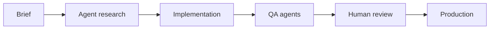

# Jayson Supsup

**Senior Shopify Developer · AI Engineer**

Shopify Plus is the core of my work. I also build WordPress and custom tools - and I use agentic AI to implement and ship.

[Website](https://digitero.me/) · [LinkedIn](https://linkedin.com/in/jaysonsupsup) · [Codeable Credential](https://www.credential.net/9a22c858-9cb4-4be5-9ce8-d2488a4245a5)

---

## About

I help ecommerce brands get more out of **Shopify and Shopify Plus**: custom themes, checkout extensions, Hydrogen storefronts, apps, and API integrations, not template restyles.

I also take on **WordPress** (Codeable Certified Expert) and **custom tools** (internal apps, dashboards, and automations) when a brand needs something the platform does not ship.

I work as an AI Engineer. Agentic workflows are how I build: research, implementation, QA, and review run through Cursor, Windsurf, Copilot, Claude, Codex, Gemini, and Ollama, plus skills and MCP tools, with a human still shipping the final change. Based in the Philippines, working with clients worldwide.

## What I work on

| Shopify Plus | WordPress | Custom tools |
| --- | --- | --- |
| Custom Liquid themes | Custom themes (FSE, Gutenberg, Sage, Underscores, Understrap) | Private Shopify apps and internal dashboards |
| Checkout Extensibility and Shopify Functions | WooCommerce and multilingual (WPML) | ERP, 3PL, and API integrations |
| Headless storefronts (Hydrogen & Oxygen) | ACF, custom post types, plugin development | Shopify Flow and agentic automations |
| Storefront, Admin GraphQL, REST, and Ajax APIs | Forms, SEO, and page builders when required | Admin portals, reporting, and ops tooling |
| B2B, Markets, performance, and CRO | Codeable-certified delivery | Product AI (GPTs, support agents) when the store needs it |

## Agentic build loop

I use agents the way an AI Engineer uses a toolchain, not as a chatbot after the fact.

| Practice | How I use it |
| --- | --- |
| Agentic coding | Cursor, Windsurf, Copilot, Claude, Codex, Gemini, and Ollama for implementation, refactors, and code review |
| Skills and rules | Repeatable agent instructions for theme, checkout, and app work |
| MCP and tools | Agents that can read the repo, APIs, and project context |
| Knowledge | Obsidian for project context |
| Eval and review | Agents draft and flag; I still own what ships |
| Product AI | Custom GPTs, Flow + LLMs, and support agents when the store needs them |

## Tech stack

**Languages & frameworks**

  

**Platforms, data & infrastructure**

    

**AI & agents**

**Design**

## GitHub

  
  

  

